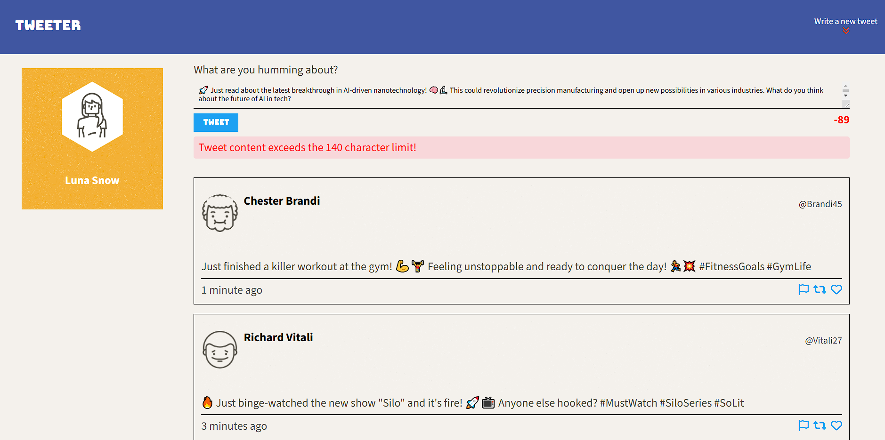

# Tweeter
Welcome to the Tweeter project! This is a full-stack web application inspired by Twitter, allowing users to create and share tweets. It's built using HTML, CSS, JavaScript, jQuery, AJAX, Node.js, and Express.

## Final Product

## Getting Started

1. Clone the repository: `git clone <repository-url>`
2. Navigate to the project directory: `cd tweeter`
3. Install dependencies: `npm install`
4. Start the web server: `npm run local`
5. Open the app in your browser: Navigate to <http://localhost:8080/> to view the app.

## Features

### User Authentication:
Secure login and registration for users.
### Create Tweets:
Users can compose and post tweets.
### View Tweets: 
Timeline showing tweets from all users.
### Responsive Design: 
Mobile-friendly layout and design.
### Real-time Updates: 
Tweets appear in real-time without refreshing the page.
### Character Count Validation: 
Live character count for tweets with a 140 character limit.
### Error Handling:
User-friendly error messages for invalid inputs.

## Dependencies

- Node.js
- Express
- jQuery
- Body-parser
- Nodemon
